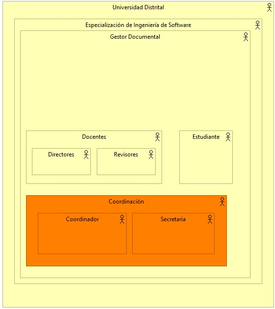
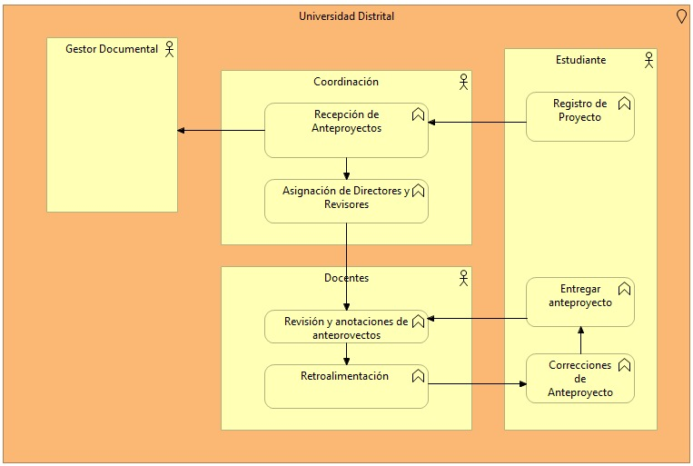

# EjercicioArchimateModelado
Ejercicio con Archimate para describir una arquitectura a nivel de negocio para la gestión de procesos de proyectos de grado en la universidad Distrital Francisco José de Caldas 

## Integrantes

- Cristian Felipe Patiño Cáceres - 20141020079
- Cristian David Santoyo Parra - 20141020077
- Brian Giovanny Alfonso Rodriguez - 20151020600
- Catalina Hernandez Casas - 20201099034

# Problema

Se necesita modelar la gestión del proceso para el seguimiento de proyectos de grado para la especialización de ingeniería de software de la Universidad Distrital Francisco José de Calda. Este modelado se debe realizar a traves de **Archimate** y se pide modelar:

* ViewPoint a nivel de organización
* ViewPoint de Funciones de negocio
* ViewPoint de Procesos de negocio

Esto se realiza para la posterior implementación de un sistema de documentación de modalidad virtual para facilitar los procesos de gestión de proyectos de grado.

# Solución

## ViewPoint a nivel de Organización

    
    

## ViewPoint a nivel de procesos de negocio

    
    

