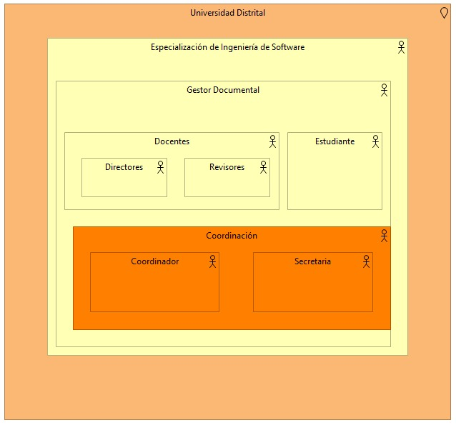
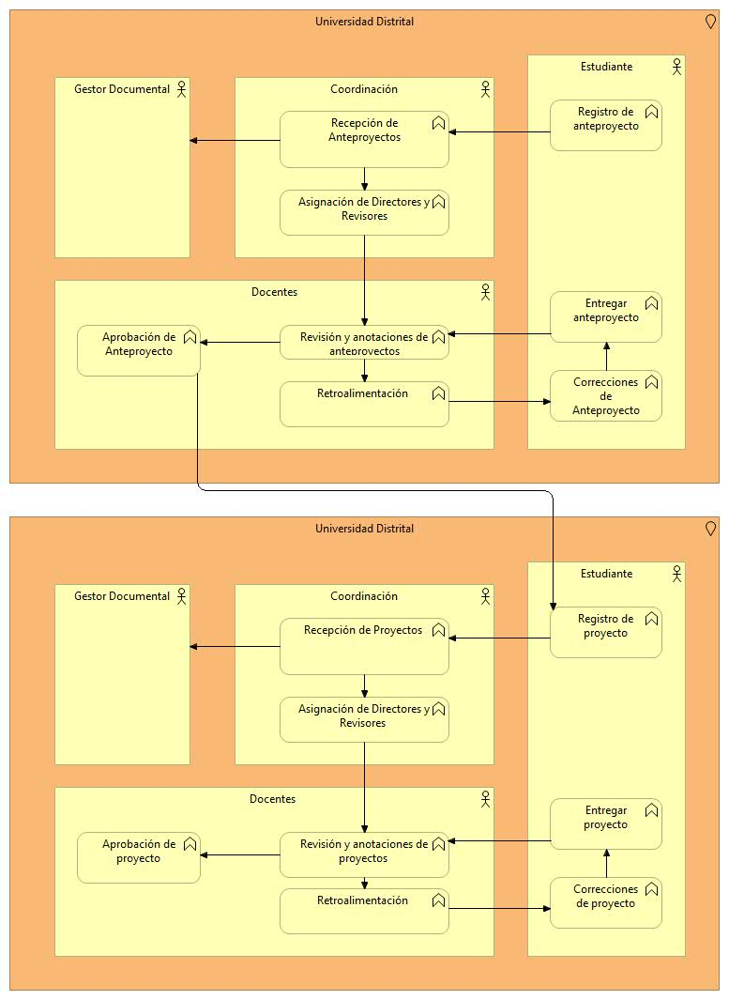

# EjercicioArchimateModelado
Ejercicio con Archimate para describir una arquitectura a nivel de negocio para la gestión de procesos de proyectos de grado en la universidad Distrital Francisco José de Caldas 

## Integrantes

- Cristian Felipe Patiño Cáceres - 20141020079
- Cristian David Santoyo Parra - 20141020077
- Brian Giovanny Alfonso Rodriguez - 20151020600
- Catalina Hernandez Casas - 20201099034

# Problema

Se necesita modelar la gestión del proceso para el seguimiento de proyectos de grado para la especialización de ingeniería de software de la Universidad Distrital Francisco José de Calda. Este modelado se debe realizar a traves de **Archimate** y se pide modelar:

* ViewPoint a nivel de organización
* ViewPoint de Funciones de negocio
* ViewPoint de Procesos de negocio
* ViewPoint a nivel de Aplicación
* ViewPoint a nivel de uso de Aplicación
* ViewPont a nivel de uso de la Infraestructura
* ViewPont Landscape Map Viewpoint
* ViewPont Landscape Map Viewpoint

Esto se realiza para la posterior implementación de un sistema de documentación de modalidad virtual para facilitar los procesos de gestión de proyectos de grado.

# Solución

## ViewPoint a nivel de Organización

    
    

## ViewPoint a nivel de funciones de negocio

    
    

## ViewPoint a nivel de procesos de negocio

    
    

## ViewPoint a nivel de Aplicación

    
    

## ViewPoint a nivel de uso de Aplicación

    
    

## ViewPont a nivel de uso de la Infraestructura

    
    

# Análisis del uso de Viewpoints orientados a capas

##  Importancia de "Layered Viewpoint"
Este diagrama radica su importancia en dar una vision general de la arquitectura de una empresa, mostrando en capas los objetos y relaciones que la componen, el propósito y ventaja es mostrar de manera general la información acerca de la estructura empresarial.

##  Importancia de "Landscape Map Viewpoint"

## Análisis general 

Estos diagramas permiten abstraer un panorama general e integro del funcionamiento de un sistema; en particular, una aplicación de software, mientras describe los distintos componentes asociados al mismo, sus relaciones, sus interacciones y los distintos escenarios en los que se manifiestan.

Proporciona ademas una simplicidad para representar relaciones arquitectónicas, ya que en la practica es muy difícil contemplar y tener en cuenta todos los factores que intervienen para el funcionamiento arquitectural de una infraestructura empresarial. El uso de un modelo que colapsa de manera resumida y ordenada a traves capas que información debe ser recibida, enviada y gestionada y que procesos deben estar presentes para el control de esta da una ventaja para el entendimiento de la arquitectura para los interesados, los cuales incluyen los arquitectos, equipos de desarrollo e incluso a los clientes.